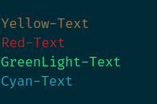
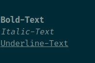
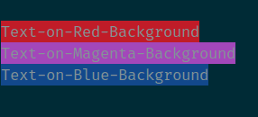
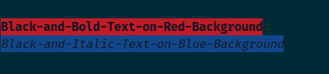
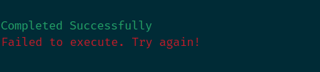
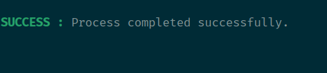
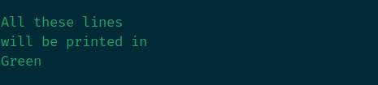

# Chalk

Chalk is a Go Package which can be used for making terminal output more vibrant with text colors, text styles and background colors.

### Mininum Requirements
`Go v1.18`

### Documentation
Check out godoc for some example usage: http://godoc.org/github.com/vinay03/chalk


### Syntax
```
chalk[.<TextColor>()][.<TextStyle>()][.<BackgroundColor>()]
```

### Examples

#### 1. Text Colors
```go
package main
import (
	"github.com/vinay03/chalk"
)
func main() {
	chalk.Yellow().Println("Yellow-Text")
	chalk.Red().Println("Red-Text")
	chalk.GreenLight().Println("GreenLight-Text")
	chalk.Cyan().Println("Cyan-Text")
}
```
`Output:`


##### More Text Colors
| TextColor       | Syntax       |
|--------------|--------------|
| Black        | `chalk.Black()` |
| BlackLight   | `chalk.BlackLight()` |
| Red          | `chalk.Red()` |
| RedLight     | `chalk.RedLight()` |
| Green        | `chalk.Green()` |
| GreenLight   | `chalk.GreenLight()` |
| Yellow       | `chalk.Yellow()` |
| YellowLight  | `chalk.YellowLight()` |
| Blue         | `chalk.Blue()` |
| BlueLight    | `chalk.BlueLight()` |
| Magenta      | `chalk.Magenta()` |
| MagentaLight | `chalk.MagentaLight()` |
| Cyan         | `chalk.Cyan()` |
| CyanLight    | `chalk.CyanLight()` |
| White        | `chalk.White()` |
| WhiteLight   | `chalk.WhiteLight()` |


#### 2. Text Styles
```go
package main
import (
	"github.com/vinay03/chalk"
)
func main() {
	chalk.Bold().Println("Bold-Text")
	chalk.Italic().Println("Italic-Text")
	chalk.Underline().Println("Underline-Text")
}
```
`Output:`


##### More Text Styles
| Style    | Syntax          |
|---------------|--------------|
| Bold  | `chalk.Bold()` |
| Dim  | `chalk.Dim()` |
| Italic  | `chalk.Italic()` |
| Underline  | `chalk.Underline()` |
| Inverse  | `chalk.Inverse()` |
| Hidden  | `chalk.Hidden()` |
| Strikethrough  | `chalk.Strikethrough()` |

#### 3. Background Colors
```go
package main
import (
	"github.com/vinay03/chalk"
)
func main() {
	chalk.BgRed().Println("Text-on-Red-Background")
	chalk.BgMagenta().Println("Text-on-Magenta-Background")
	chalk.BgBlue().Println("Text-on-Blue-Background")
}
```
`Output:`


##### More Background Colors
| Background-Color    | Syntax       |
|--------------|--------------|
| Black        | `chalk.BgBlack()` |
| BlackLight   | `chalk.BgBlackLight()` |
| Red          | `chalk.BgRed()` |
| RedLight     | `chalk.BgRedLight()` |
| Green        | `chalk.BgGreen()` |
| GreenLight   | `chalk.BgGreenLight()` |
| Yellow       | `chalk.BgYellow()` |
| YellowLight  | `chalk.BgYellowLight()` |
| Blue         | `chalk.BgBlue()` |
| BlueLight    | `chalk.BgBlueLight()` |
| Magenta      | `chalk.BgMagenta()` |
| MagentaLight | `chalk.BgMagentaLight()` |
| Cyan         | `chalk.BgCyan()` |
| CyanLight    | `chalk.BgCyanLight()` |
| White        | `chalk.BgWhite()` |
| WhiteLight   | `chalk.BgWhiteLight()` |


#### 4. Formatting Combinations
```go
package main
import (
	"github.com/vinay03/chalk"
)
func main() {
	chalk.Black().Bold().BgRed().Println("Black-and-Bold-Text-on-Red-Background")
	chalk.Black().Italic().BgBlue().Println("Black-and-Italic-Text-on-Blue-Background")
}
```
`Output:`



#### 5. Pre-defined Format
```go
package main
import (
	"github.com/vinay03/chalk"
)
func main() {
	SuccessFormatting := chalk.Green()
	SuccessFormatting.Println("Completed Successfully")
	ErrorFormatting := chalk.Red()
	ErrorFormatting.Println("Failed to execute. Try again!")
}
```
`Output:`



#### 6. Pre-formated Text
```go
package main
import (
	"fmt"
	"github.com/vinay03/chalk"
)
func main() {
	SuccessMessagePrefix := chalk.Green().Bold().Sprint("SUCCESS :")
	fmt.Println(SuccessMessagePrefix, "Process completed successfully.")
}
```
`Output:`



#### 7. Wrap Formating 
```go
package main
import (
	"fmt"
	"github.com/vinay03/chalk"
)
func main() {
	fmt.Print(chalk.Green()) // Starts the formatting
	fmt.Println("All these lines ")
	fmt.Println("will be printed in ")
	fmt.Println("Green")
	fmt.Print(chalk.Reset()) // Resets all the formatting
}
```
`Output:`




### More Examples
[examples/examples.go](examples/examples.go)


## Source
- https://www.lihaoyi.com/post/BuildyourownCommandLinewithANSIescapecodes.html


## Author
### Vinay Jeurkar

<p>
  <a href="https://www.linkedin.com/in/vinay-jeurkar/" rel="nofollow noreferrer" style="text-decoration:none;"></a> 
	&nbsp; 
  <a href="https://github.com/vinay03" rel="nofollow noreferrer" style="text-decoration:none;"></a> 
	&nbsp; 
  <a href="https://twitter.com/Vinay_Jeurkar" rel="nofollow noreferrer" style="text-decoration:none;"></a>
</p>

